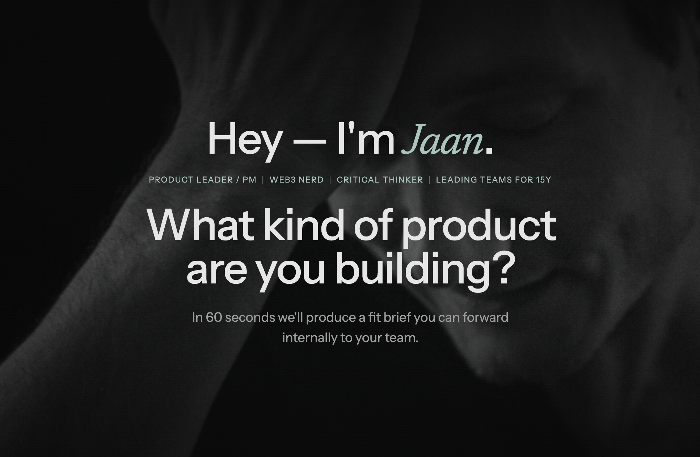

# Chat-driven resume / portfolio site



Main components / repo layout:
- **UI** (`ui/`): Astro + v2 React experience (`/`, `/cv`, `/contact`, `/c/{shareId}`)
- **Chat API** (`chat-api-service/`): FastAPI app implementing `/chat`, `/chat/stream`, `/share`, `/share/{shareId}`
- **Ingestion** (`ingest/`): Node scripts (no npm deps) for export + embeddings + Qdrant upserts
- **Deployment** (`infra-vps/`): Lightsail/VPS deployment (Docker Compose + Caddy)
- **Legacy** (`chat-api-lambda/`, `infra/`): deprecated (kept for migration/cleanup)

Core specs (source of truth):
- `_specs/spec-index.md` (start here)
- `_specs/chat-api-rag-contract.md`
- `_specs/qdrant-index-design.md`
- `_specs/ingestion-pipeline.md`

## Architecture (baseline)

Target baseline is a **single VPS/Lightsail instance** running:
- Reverse proxy (Caddy) terminating TLS and routing **same-origin** `/api/*`
- Chat API service (FastAPI)
- Qdrant (vector store)

## Prerequisites

- **Node.js 18+**
- **Python 3.11+**
- **Docker** (optional, for local Qdrant)

For full local end-to-end runs you’ll typically want:
- `OPENAI_API_KEY` (embeddings)
- `ANTHROPIC_API_KEY` (chat/router; streaming is currently Anthropic-only)

## Environment

For a clean publishable repo, env vars live in two places (copy the examples and fill secrets):

- **Local ingestion**: `ingest/.env.example` → `ingest/.env`
  - Used by `npm run ingest:*` scripts (load order: `ENV_FILE` → `ingest/.env` → repo root `.env`)
- **Production stack (VPS/Lightsail)**: `infra-vps/.env.example` → `infra-vps/.env`
  - Used by `infra-vps/docker-compose.yml` (API + Qdrant + Caddy)

## Source markdown

You can keep source Markdown in a sibling private repo/directory:
- Public repo: `resume_web/`
- Private content: `../resume_web_content/ui/src/content/**`

Ingestion auto-detects that sibling path. For explicit config (CI/deploy), set:
- `RESUME_UI_CONTENT_ROOT=../resume_web_content/ui/src/content`

For the CV page (`/cv`), Astro reads content at build-time. In CI you can inject content into `ui/src/content/` (workspace-only; never commit) before building.

## Ingestion

All ingestion scripts can be run from the repo root (no install needed for `ingest/` itself):

- Vectors (chunk + embed + index into Qdrant):

```bash
npm run ingest:vectors
```

Useful flags:

```bash
npm run ingest:vectors -- --dry-run
npm run ingest:vectors -- --no-index
```

- Full run:

```bash
npm run ingest:all
```

## Local dev (end-to-end)

### 1) Start local Qdrant

```bash
docker compose up -d
```

Qdrant should be reachable at `http://127.0.0.1:6333`.

### 2) Ingest content into Qdrant

```bash
npm run ingest:all
```

### 3) Run the Chat API (FastAPI)

```bash
cd chat-api-service
python -m venv .venv
source .venv/bin/activate
pip install -r requirements.txt
uvicorn app.main:app --reload --port 8000
```

Health check:

```bash
curl http://127.0.0.1:8000/healthz
```

### 4) Run the UI (Astro)

The UI calls these same-origin endpoints:
- `POST /api/chat`
- `POST /api/chat/stream`
- `POST /api/share`
- `GET /api/share/{shareId}`

During dev, Astro proxies `/api/*` to the local FastAPI service (default target is `http://127.0.0.1:8000`).

```bash
cd ui
npm ci
npm run dev
```

To point the dev proxy elsewhere:

```bash
CHAT_API_PROXY_TARGET=http://<host>:8000 npm run dev
```

## Tests (Chat API)

```bash
cd chat-api-service
source .venv/bin/activate
pip install -r requirements-dev.txt
pytest -q
```

## Deployment

See `infra-vps/DEPLOY-LIGHTSAIL.md`.