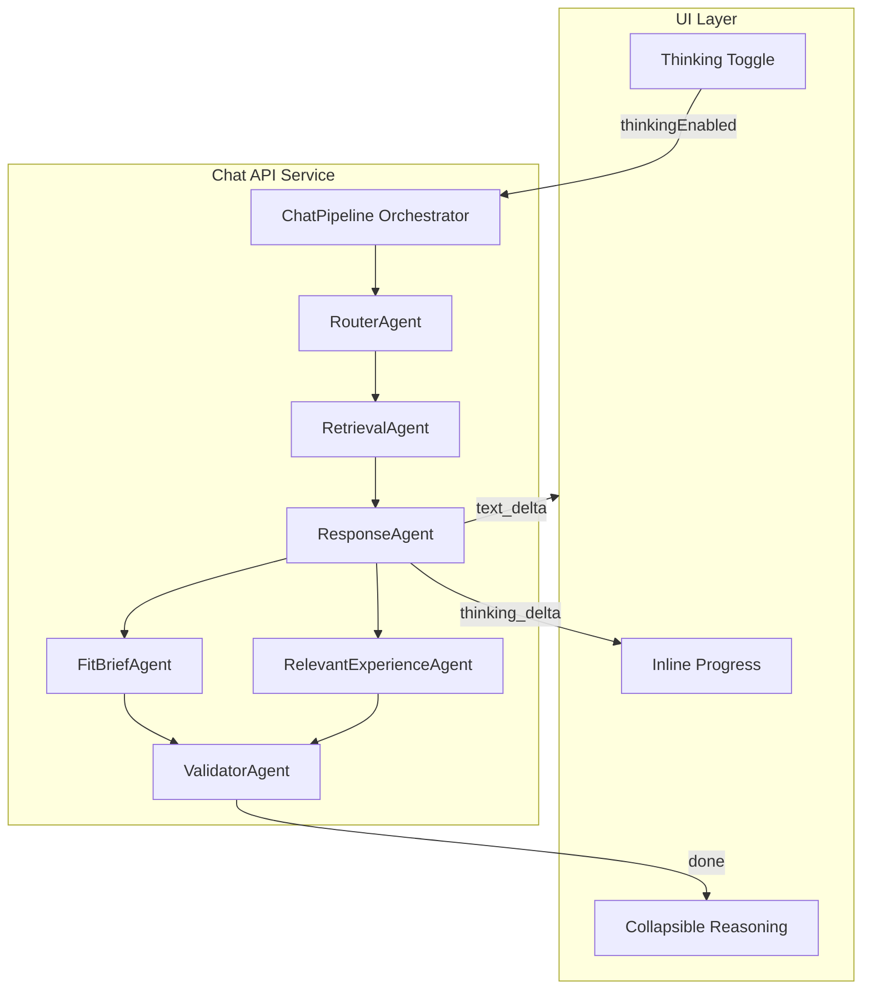

## Thinking mode (async reasoning) — spec

This doc defines the **thinking mode** feature end-to-end:
- UX requirements (toggle, progress, collapsible reasoning)
- API contract additions (request/response fields, SSE events)
- backend execution model (agent pipeline + streaming)
- hard constraints from Anthropic extended thinking
- current limitations + fallbacks

If anything conflicts, defer to:
- `_specs/chat-api-rag-contract.md` for the baseline chat contract
- `_specs/user-flow-v2.md` for the v2 UX flow

---

## Architecture overview

---

## Goals

- **User-visible reasoning**: show a “thinking” phase before the final answer, then show a collapsible reasoning section above the answer.
- **Toggleable**: users can disable thinking mode (old/simple mode remains available).
- **Default on**: thinking is enabled by default.
- **Streaming-first**: the UI should feel responsive while thinking is happening.
- **Future-proof**: backend structured as discrete agents so it can migrate to LangGraph later.

---

## UX requirements (v2)

### Toggle

- **Default**: enabled.
- **Persistence**: stored in localStorage.
- **Placement**: small toggle icon near the input (chat + split views).

### Streaming behavior (UI)

- **Thinking phase**:
  - show **inline progress** during reasoning (snippets rotate; user sees activity)
  - consume `event: thinking` deltas
- **Answer phase**:
  - switch to streaming answer text (`event: text`)
  - hide the thinking progress indicator once answer text begins streaming

### Completed response

- If `response.thinking` is present, render a **collapsed & expandable** “Reasoning” section **above** the assistant answer message.
- Chips render normally when present.

---

## API contract additions (v2)

This spec complements `_specs/chat-api-rag-contract.md`. The baseline shapes remain the same; thinking mode adds:

### Request

- **`client.thinkingEnabled?: boolean`**
  - default: `true`
  - when `true`, server attempts to use extended thinking (Anthropic) and streams thinking deltas

### Response

- **`thinking?: string`**
  - summarized reasoning / chain-of-thought style content for UI display (collapsible)

### SSE (`POST /api/chat/stream`)

Additional event:

- `event: thinking` with `data: {"delta": "..."}` emitted during the thinking phase.

Ordering requirement:

- When thinking mode is enabled, `thinking` deltas should arrive **before** `text` deltas.

---

## Backend behavior

### Execution model (current)

- RouterAgent → RetrievalAgent → ResponseAgent → ValidatorAgent (sequential orchestrator)
- ResponseAgent is responsible for streaming:
  - thinking deltas
  - answer text deltas
  - final done payload

### Two response modes (important)

Thinking mode introduces a practical compatibility split:

- **Structured JSON mode (simple / thinking disabled)**:
  - uses structured outputs / JSON schema (when configured)
  - supports rich artifacts (`fitBrief`, `relevantExperience`) reliably

- **Extended thinking mode (thinking enabled)**:
  - uses Anthropic extended thinking streaming
  - **structured outputs may be incompatible** with extended thinking (provider constraint)
  - model may return **plain text** instead of JSON; server must apply fallbacks

### Plain-text fallback (current implementation)

When extended thinking returns plain text (not JSON):
- server wraps it as `{ assistant: { text }, ui: ..., chips: [...] }`
- optional chip extraction: if the model emits a JSON-ish list at the end (e.g. `["A", "B"]`), the server extracts it into `chips[]` and removes it from `assistant.text`.

---

## Anthropic extended thinking constraints

These constraints must be enforced by the server when `thinkingEnabled=true`:

- **Temperature** must be `1`.
- **Token budgeting**: `max_tokens` must be **greater than** `thinking.budget_tokens`.
  - otherwise Anthropic returns `400` (`invalid_request_error`).

Configuration knobs:
- `ANTHROPIC_THINKING_BUDGET_TOKENS` (default: 10,000)
- `ANTHROPIC_ANSWER_MAX_TOKENS` (must be > budget)

---

## Migration notes (future)

This repo is structured to migrate to LangGraph later:
- Agents become graph nodes.
- Independent post-response agents (FitBriefAgent, RelevantExperienceAgent) can be executed in parallel.

